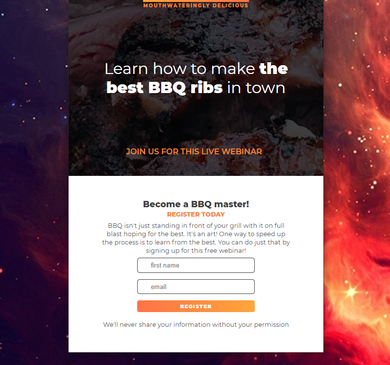

## Rib Splash 

## Summary

A simple splash page that I re-created by eye, Using the browser dev tools and what i've learned about css and flexbox. This is a one page site, with form validation and a simple js triggered confirmation after the form is submitted. 

 

 

 

 

The page is responsive with one mobile breakpoint, and will stack content on smaller screens.

 

 

 

This is one of several website projects that I've been creating recently to get practice in between portfolio projects to keep sharp with the basics.

**Author**
 
**Robin Fussell** _- Software Developer_ | [LinkedIn](https://www.linkedin.com/in/robin-fussell17/)